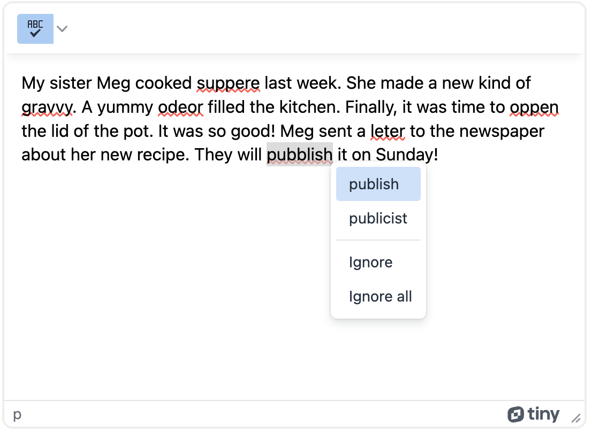

# A free spell checker for TinyMCE 6

### This example uses Create React App and ASP.NET Core, but any frontend + backend will do.
This repo uses the [Spell Checker tool for TinyMCE v5](https://www.tiny.cloud/docs/plugins/opensource/spellchecker/), porting it to TinyMCE v6 and converting the PHP backend to ASP.NET Core.

Any backend can be used, your endpoint just has to:
1. Take in three arguments: `text: string, lang: string, method: string`.
2. Return an object `{ "words": { *MISPELLED WORD 1 AS STRING*:[*SUGGESTED REPLACEMENTS AS A LIST OF STRINGS*], *MISPELLED WORD 2 AS STRING*:[*SUGGESTED REPLACEMENTS AS A LIST OF STRINGS*], ... } }`.
3. To show a built in TinyMCE error toast, return `{"error": *ERROR MESSAGE AS STRING* }`.

If there are no suggested replacements for a misspelled word, the suggested replacements array can be left empty.

If there are no misspelled words, the API should return `{ "words": {} }`. This will display a toast that says "No misspellings found."

# Setup
To setup this project:
1. Run `npm install` in the `ui` directory.
2. Run `npm start` in the `ui` directory.
3. Run `dotnet run` in the `api` directory.

# Add more languages
Currently English, Spanish, and French dictionaries are setup in this project, other languages will cause an error. To add more languages, add .dic and .aff files to the api/Dicts directory.

NOTE: For performance, the TinyMCE JS should be minified before prod deployment. The minified TinyMCE JS in this repo does not contain the spellchecker changes.